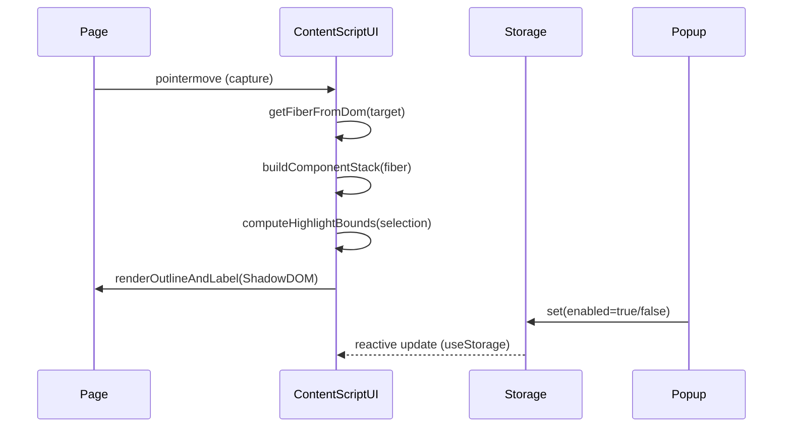

# React UI Mapper (Plasmo) — Build Plan

## What you’re building (v1)

You selected **Two-way Inspector**:

- **Hover-to-identify**: hover any UI element and instantly see the nearest meaningful React component name (plus a short ancestor stack).
- **Click-to-pin**: freeze the selection so you can move the cursor to the panel.
- **Panel-to-select**: click any component in the shown stack (or filtered list) to highlight that component’s rendered area (not just the hovered DOM node).
- **Copy-friendly**: one-click copy for component name, breadcrumb stack, and (when available) file/line.

### Non-goals (v1)

- Full “page minimap” of all components at once (costly + noisy).
- Production-grade source-location linking to editor across all bundlers (we’ll use dev-only debug metadata when present).
- Reading props/state like React DevTools (this tool is about _UI placement_, not state inspection).

## Key research inputs (best-practice anchors)

- **Plasmo CSUI**: CSUI mounts a Shadow DOM root container and renders your exported component(s) into the page ([CSUI overview](https://docs.plasmo.com/framework/content-scripts-ui), [life cycle](https://docs.plasmo.com/framework/content-scripts-ui/life-cycle), [styling](https://docs.plasmo.com/framework/content-scripts-ui/styling)).
- **Plasmo project setup**: `pnpm create plasmo` and dev workflow ([new extension](https://docs.plasmo.com/framework/workflows/new), [dev server](https://docs.plasmo.com/framework/workflows/dev)).
- **Chrome isolated worlds**: content scripts can’t see page _JS variables_, but they do share the DOM; expando properties on DOM nodes are visible across worlds (Chrome doc’s `button.person_name` example in [content scripts](https://developer.chrome.com/docs/extensions/develop/concepts/content-scripts#isolated_world)).
- **React Fiber key**: React DOM attaches an internal instance key like `__reactFiber$<random>` to host DOM nodes (see `internalInstanceKey` and `precacheFiberNode` in React’s `ReactDOMComponentTree.js`: [source](https://raw.githubusercontent.com/facebook/react/main/packages/react-dom-bindings/src/client/ReactDOMComponentTree.js)).

## Architecture overview

### Runtime pieces

- **Content Script UI (CSUI)**: in-page overlay + inspector panel + event listeners. Primary runtime.
- **Popup**: quick toggle + small settings.
- **Options**: advanced settings (activation mode, stack depth, allowlist/publishing-mode, etc.).
- **Background service worker (optional but recommended)**: keyboard shortcuts (Chrome `commands`) and optional host permission workflows.

### Data flow



## Core technical approach

### 1) DOM → Fiber → Component stack

**Primary strategy (recommended)**: read React’s expando key on DOM nodes.

- Find keys that start with `__reactFiber$` (React 16+) and also try `__reactInternalInstance$` (legacy React).
- Maintain a small `knownFiberKeys: string[]` cache so we do a fast probe first, only scanning property names when needed.
- Traverse `fiber.return` upward to skip host fibers (`typeof fiber.type === "string"`) and non-user fibers until we hit something that represents a user component (function/class) or a wrapper (memo/forwardRef) we can label.

**Why this is best for v1**:

- Works from an isolated-world content script because the data is on the DOM node itself (no need to access page globals).
- No dependency on React DevTools being installed.

**Known risks**:

- It’s internal/unsupported. React could change internals; we’ll guard and degrade gracefully.
- Some builds may reduce useful names; we’ll show best-available names + stack.

### 2) “Two-way” highlight: Component → rendered bounds

When the user clicks a component in the panel:

- Starting from that component fiber, traverse its subtree to collect **host DOM elements** (`fiber.stateNode` where it’s an Element, plus host component fibers).
- Compute:
  - **Primary**: a union bounding rect (fast, stable, but may be larger than visible).
  - **Optional**: multi-rect outlines for the first N host nodes (more accurate, more visual noise).

Performance guardrails:

- Hard cap host nodes scanned (e.g., 200) with a “+N more” indicator.
- Throttle hover updates with `requestAnimationFrame` and don’t recompute bounds if pinned.
- Recompute bounds on `scroll`/`resize` only when a selection is active.

### 3) Shadow DOM + styling (Plasmo CSUI)

We’ll use Plasmo’s built-in Shadow DOM root container.

Best practices from Plasmo docs:

- Inject local CSS via `getStyle` + `data-text:` imports (keeps styles isolated).
- Keep CSUI root container above the page via a high `z-index` (Plasmo styling notes mention `#plasmo-shadow-container` and `!important` as needed).
- Avoid generic CSS variable names; prefix (e.g., `--rum-*`) to prevent collisions.

Important interaction detail:

- Make the **outline layer** `pointer-events: none`.
- Make the **panel** `pointer-events: auto`.
- Ignore hover events when `event.composedPath()` includes our panel root (so we never inspect ourselves).

### 4) Storage-driven toggle (no constant messaging)

Use Plasmo storage hooks:

- `useStorage("enabled", false)` in popup/options.
- `useStorage("enabled")` in CSUI to start/stop listeners and render nothing when disabled.

(Reference: Plasmo `useStorage` patterns in [with-chrome-storage](https://docs.plasmo.com/quickstarts/with-chrome-storage) and framework storage docs.)

## UX & visual design (frontend-design direction)

### Concept: “Architect’s overlay”

Make the tool feel like an AR annotation layer for UI architecture:

- **Outline**: sharp corner brackets + a single accent stroke (high visibility), with subtle animated “snap” when switching targets.
- **Label**: compact, high-contrast pill; component names in `ui-monospace` to match dev mental model.
- **Panel**: small “inspector slate” in a corner with a calm density: search, stack list, pin state, copy buttons.

Accessibility + ergonomics:

- Respect reduced motion (`prefers-reduced-motion`).
- Color palette tuned for both dark and light pages.
- Keyboard affordances: `Esc` to unpin/exit; `/` focuses search (optional).

## Project setup (Plasmo)

### Scaffold

Use Plasmo’s official workflow:

```bash
pnpm create plasmo react-ui-mapper --with-src
cd react-ui-mapper
pnpm dev
```

- Load the dev build from `build/chrome-mv3-dev` per Plasmo’s dev workflow.

### Proposed file structure

- `react-ui-mapper/assets/` (icons, optional fonts)
- `react-ui-mapper/src/`
  - `popup.tsx`
  - `options.tsx`
  - `background.ts` (commands + optional permissions)
  - `contents/inspector.tsx` (CSUI entry)
  - `core/reactFiber.ts` (DOM→Fiber + naming)
  - `core/hostBounds.ts` (fiber subtree → DOM nodes → rects)
  - `ui/Overlay.tsx` (outline + label)
  - `ui/InspectorPanel.tsx` (panel)
  - `ui/styles/inspector.css` (imported via `data-text:`)

## Permissions & publishing strategy

There are 3 viable permission models; we’ll implement in phases:

- **MVP dev speed (phase 1)**: match broad URLs (`<all_urls>`) but keep the tool disabled by default and only render when enabled.
- **Store-friendly (phase 2)**: switch to an allowlist/optional-host-permissions model:
  - options page lets user “Enable on this site” → request host permission
  - reduces scary permissions while keeping functionality.

## Milestones (1–2 weeks)

### Week 1: Working hover + stack + two-way selection

- Scaffold Plasmo project (`--with-src`), confirm CSUI renders.
- Implement `getFiberFromDom` with key caching + safe traversal.
- Hover highlight (outline + label).
- Build and render **component stack** panel; click-to-pin.
- Implement “select ancestor component” → compute host bounds → highlight.
- Copy actions + basic settings (stack depth, show source when available).

### Week 2: Polish + scale + publish readiness

- Performance hardening: raf throttle, diffing, caps, scroll/resize handling.
- Shadow DOM edge cases: high z-index, pages with aggressive global `*` CSS (Plasmo caveats).
- Better naming: unwrap `memo()` / `forwardRef()` and surface displayName consistently.
- Optional: add a lightweight “Root Explorer” mode (build index from hovered root fiber; search + select).
- Permissions hardening for OSS release (optional host permissions).
- Docs: README, demo GIF, troubleshooting (minified names, non-React pages, portals).

## Error handling & graceful degradation

- If no fiber key found: panel shows “No React fiber detected on hovered element” + tips.
- If names are missing/minified: still show stack but label as “Minified/Anonymous”.
- If selected component has no host nodes: fallback to hovered host element bounds.

## Test plan

- **Manual**:
  - Vite React app, Next.js app, CRA-like app
  - Hover correctness, pin/unpin, selecting ancestors
  - Scroll/resize updates
  - Portals/modal rendering
  - Pages with Shadow DOM elements (basic sanity)
- **Automated** (lightweight):
  - Unit tests for fiber traversal/name formatting using mocked fiber objects
  - Unit tests for bounds union logic with synthetic rects

## Future enhancements

- “Click component in panel → scroll into view”
- Multiple outlines for multi-host components
- Integrate with `sourceURL`/source maps when available
- Export “component map snapshot” (JSON) for debugging sessions
