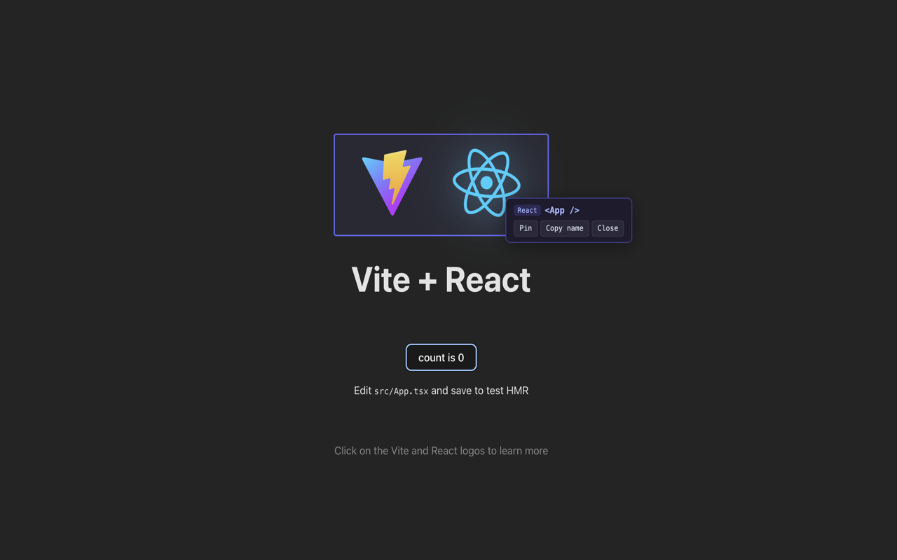
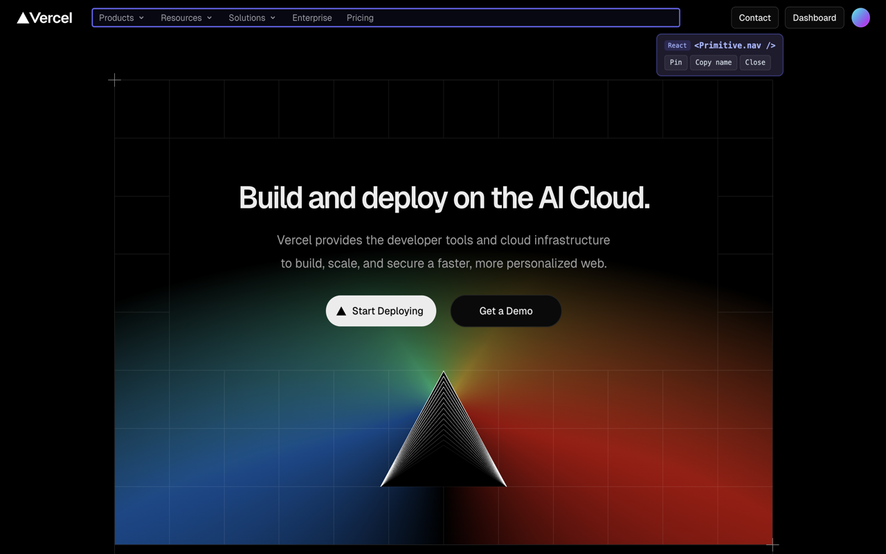

# WhoRenderedThis

[](https://opensource.org/licenses/MIT)
[](https://github.com/nabobery/WhoRenderedThis/actions/workflows/ci.yml)
[](https://github.com/nabobery/WhoRenderedThis/releases)

A browser extension that maps React components to their visual positions in the rendered page. Hover over any element on a React app and instantly see which component rendered it.

## Screenshots





## Installation

### From Store (Recommended)

- **Microsoft Edge**: [Edge Add-ons](https://microsoftedge.microsoft.com/addons/detail/whorenderedthis/gnppbipjiohpjdelkllmnbmakldfdeji)
- **Mozilla Firefox**: [Firefox Add-ons](https://addons.mozilla.org/en-US/firefox/addon/whorenderedthis/)
- **Chrome Web Store**: Coming soon

### Development Build

1. Clone the repository:

   ```bash
   git clone https://github.com/nabobery/WhoRenderedThis.git
   cd WhoRenderedThis
   ```

2. Install dependencies and build:

   ```bash
   pnpm install
   pnpm build
   ```

3. Load in browser:
   - Go to `chrome://extensions` or `edge://extensions`
   - Enable "Developer mode"
   - Click "Load unpacked"
   - Select the `.output/chrome-mv3` directory

## Features

- **Visual Component Inspector** — Hover over any UI element to see the React component that rendered it
- **Component Name + Source** — Shows `displayName`/`name` and source file location in dev builds
- **React 16-19 Support** — Version-aware source extraction: `_debugSource` for React 16-18, `_debugStack` parsing for React 19+
- **Version Badge** — Displays detected React version range ("React 16-18", "React 19+") and build type
- **Parent Component Chain** — When pinned, shows ancestor components with source locations (e.g., "App (App.tsx:5) > Layout (Layout.tsx:12)")
- **Pin Selection** — Click to lock the current selection; click again or press Escape to unpin
- **Copy to Clipboard** — Copy component name with source location; includes parent chain when pinned
- **Zero Config** — Works on any page using React (dev or production builds)
- **CSS Isolated** — Overlay UI is rendered inside a Shadow DOM so it never interferes with the page

## How It Works

1. Click the extension icon to activate the inspector on the current tab
2. A **content script** is injected into the page (isolated world) that mounts a Shadow DOM overlay
3. A **main-world script** is injected alongside it — this script can access React's internal `__reactFiber$` properties on DOM elements
4. On hover, the content script asks the main-world script to resolve the element under the cursor to its nearest React component via Fiber tree traversal
5. **Version-aware source resolution** detects the React version and uses the appropriate strategy:
   - React 16-18: reads `fiber._debugSource` directly
   - React 19+: parses `fiber._debugStack` Error object (same technique as React DevTools)
6. The overlay highlights the component's bounding box and displays its name, source location, and version badge

## Tech Stack

- [WXT](https://wxt.dev/) — Vite-powered extension framework
- [React](https://react.dev/) — UI for the overlay panel
- Manifest V3 (Chromium)

## Development

```bash
pnpm install
pnpm dev          # Chrome dev mode with HMR
pnpm dev:firefox  # Firefox dev mode
pnpm build        # Production build for Chrome
pnpm zip          # Package for distribution
pnpm check        # Type check + lint + format
pnpm test:run     # Run tests
```

## Documentation

- [Architecture Overview](docs/architecture.md)
- [Contributing Guide](CONTRIBUTING.md)

## Compatibility

- **Browsers**: Chrome, Edge, Firefox, Brave, and other Chromium-based browsers
- **React Versions**: 16, 17, 18, 19
- **Frameworks**: Create React App, Next.js, Vite, Remix, Gatsby

## Privacy

This extension:

- Does not collect any user data
- Does not make any network requests
- Operates entirely locally in your browser
- Only activates when you click the extension icon

See [SECURITY.md](SECURITY.md) for more details.

## Contributing

Contributions are welcome! Please read our [Contributing Guide](CONTRIBUTING.md) and [Code of Conduct](CODE_OF_CONDUCT.md) before submitting a PR.

## License

MIT
