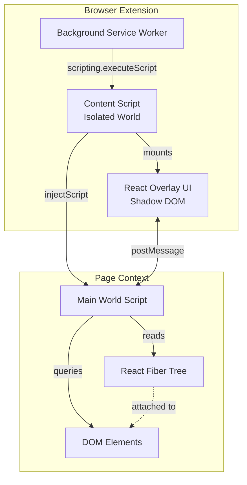
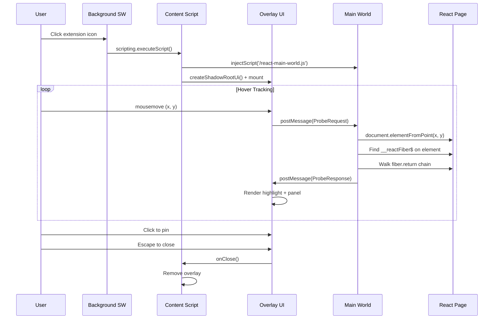
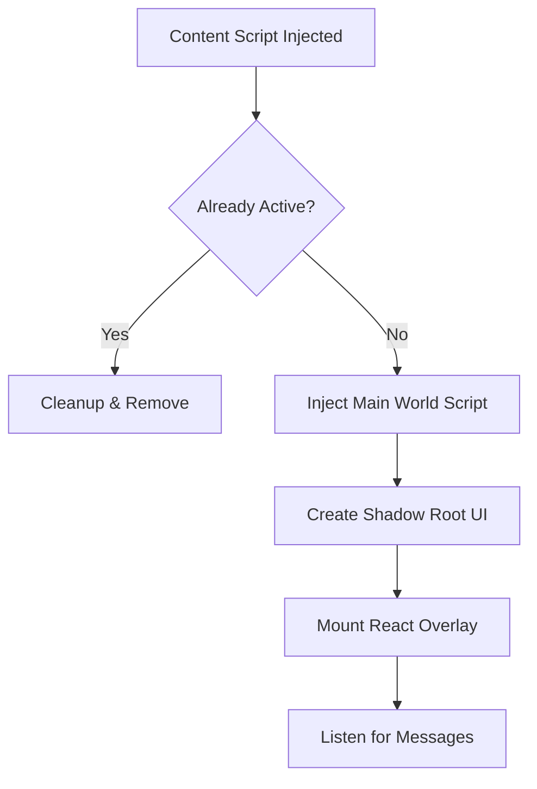
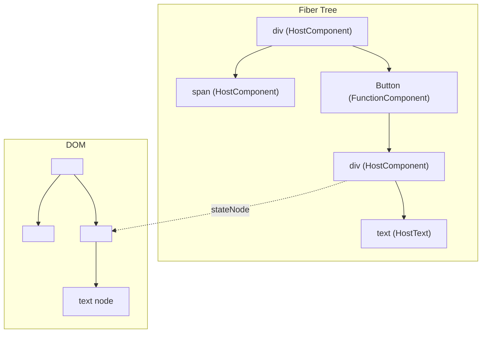
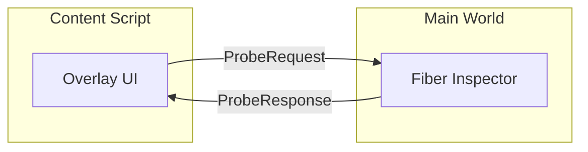
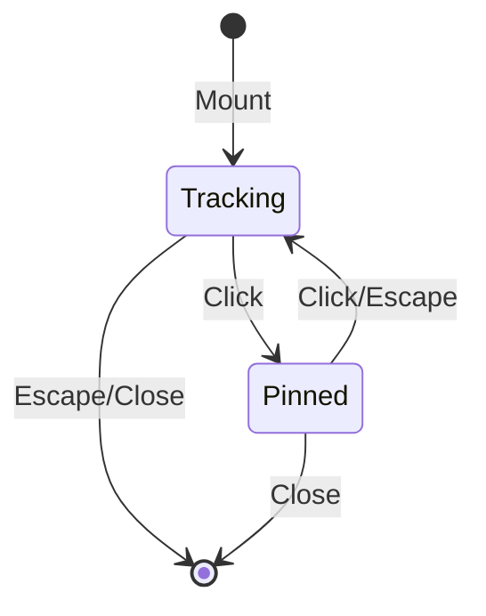

# WhoRenderedThis - Technical Architecture

## Overview

**WhoRenderedThis** is a Chromium browser extension that enables developers to visually inspect React applications by hovering over any UI element to discover which React component rendered it. The extension solves a fundamental challenge: bridging the gap between the visual DOM representation users see and the React component tree that generated it.

## The Problem

When debugging or exploring React applications, developers often ask: _"Which component rendered this element?"_ While React DevTools provides a component tree view, it requires context-switching between the page and DevTools panel. WhoRenderedThis brings this information directly into the page as an interactive overlay.

### Technical Challenges

1. **Isolated Context Boundaries**: Browser extensions run in an isolated world with no direct access to the page's JavaScript context where React's internal data structures live.

2. **React Fiber Internals**: React attaches internal `__reactFiber$` properties to DOM elements, but these are private APIs not accessible from extension content scripts.

3. **CSS Collision**: Injected overlay UI must not be affected by the host page's styles, and vice versa.

4. **Performance**: Continuous hover tracking must not degrade page responsiveness.

---

## Architecture Overview

The extension uses a **three-layer architecture** to bridge the isolation boundary between extension scripts and the page's JavaScript context:



### Layer Responsibilities

| Layer          | File                    | World          | Purpose                                                    |
| -------------- | ----------------------- | -------------- | ---------------------------------------------------------- |
| Background     | `background.ts`         | Service Worker | Responds to extension icon clicks, injects content script  |
| Content Script | `inspector.content.tsx` | Isolated       | Mounts overlay UI, bridges messages, manages lifecycle     |
| Main World     | `react-main-world.ts`   | Page Context   | Performs React Fiber introspection, returns component data |
| Overlay UI     | `Overlay.tsx`           | Shadow DOM     | Renders inspector panel and highlight box                  |

---

## Message Flow Sequence



---

## Core Implementation Details

### 1. Background Service Worker (`entrypoints/background.ts`)

The background script is minimal by design. It listens for extension action clicks and injects the content script:

```typescript
export default defineBackground(() => {
  browser.action.onClicked.addListener(async (tab) => {
    if (!tab.id) return;
    await browser.scripting.executeScript({
      target: { tabId: tab.id },
      files: ['content-scripts/inspector.js'],
    });
  });
});
```

**Key Design Decisions:**

- Uses MV3 `scripting.executeScript` API (not manifest-declared content scripts)
- Runtime injection enables on-demand loading and toggle behavior
- Minimal permissions: only `activeTab` and `scripting`

---

### 2. Content Script (`entrypoints/inspector.content.tsx`)

The content script serves as the orchestration layer:



#### Toggle Mechanism

```typescript
const existing = document.querySelector(HOST_TAG) as InspectorHostElement | null;
if (existing) {
  if (typeof existing.__wrtCleanup === 'function') {
    existing.__wrtCleanup();
  } else {
    existing.remove();
  }
  return;
}
```

The toggle pattern stores a cleanup function on the host element, enabling clean teardown without persistent state.

#### Shadow DOM Isolation

WXT's `createShadowRootUi` provides complete CSS isolation:

```typescript
const ui = await createShadowRootUi<Root>(ctx, {
  name: HOST_TAG,           // Custom element: <who-rendered-this>
  position: 'overlay',      // Position fixed, no layout impact
  anchor: 'body',
  onMount(container, _shadowRoot, shadowHost) {
    const host = shadowHost as InspectorHostElement;
    host.__wrtCleanup = () => ui.remove();

    const root = createRoot(container);
    root.render(<Overlay onClose={() => ui.remove()} />);
    return root;
  },
  onRemove(root) {
    root?.unmount();
  },
});

ui.mount(); // Explicitly mount the UI
```

**Benefits:**

- Page styles cannot affect overlay appearance
- Overlay styles cannot leak into the page
- Clean mounting/unmounting lifecycle

---

### 3. Main World Script (`entrypoints/react-main-world.ts`)

This is the heart of React Fiber introspection. It runs in the page's JavaScript context, giving it access to React's internal data structures.

#### Fiber Key Discovery

React attaches internal data to DOM elements using keys with random suffixes:

```typescript
const FIBER_PREFIXES = ['__reactFiber$', '__reactInternalInstance$'];

function getFiber(el: Element): FiberNode | null {
  const keys = Object.getOwnPropertyNames(el);
  for (const key of keys) {
    for (const prefix of FIBER_PREFIXES) {
      if (!key.startsWith(prefix)) continue;
      const value = (el as Record<string, unknown>)[key];
      if (typeof value === 'object' && value !== null) {
        return value as FiberNode;
      }
    }
  }
  return null;
}
```

**Why multiple prefixes?** React's internal property names have changed across versions. Supporting both ensures compatibility with React 16+ through React 19.

#### Fiber Tree Navigation



The algorithm walks up the fiber tree to find user components:

```typescript
function findNearestComponentFiber(fiber: FiberNode): FiberNode | null {
  let current: FiberNode | null = fiber;
  while (current) {
    // User components have function/class types
    // Host components have string types like "div"
    if (current.type && typeof current.type !== 'string' && typeof current.type !== 'symbol') {
      return current;
    }
    current = current.return;
  }
  return null;
}
```

#### Component Name Extraction

React components can be named in various ways:

```typescript
function getComponentName(type: unknown): string {
  // Function component: type.name or type.displayName
  if (typeof type === 'function') {
    const displayName = getStringProp(type, 'displayName');
    return displayName ?? type.name ?? 'Anonymous';
  }

  if (isRecord(type)) {
    // Check displayName first
    const displayName = getStringProp(type, 'displayName');
    if (displayName) return displayName;

    // React.forwardRef: type.render
    const render = type.render;
    if (typeof render === 'function') return getComponentName(render);

    // React.memo: type.type
    const inner = type.type;
    if (inner) return getComponentName(inner);
  }

  return 'Anonymous';
}
```

**Handled cases:**

- Function components (`function MyComponent() {}`)
- Class components (`class MyComponent extends React.Component`)
- `displayName` static property
- `React.forwardRef` wrapped components
- `React.memo` wrapped components

#### Debug Source Information

In development builds, React includes source file information:

```typescript
interface DebugSource {
  fileName?: string;
  lineNumber?: number;
  columnNumber?: number;
}

if (fiber._debugSource && isRecord(fiber._debugSource)) {
  source = {
    fileName: fiber._debugSource.fileName,
    lineNumber: fiber._debugSource.lineNumber,
    columnNumber: fiber._debugSource.columnNumber,
  };
}
```

> **Note:** `_debugSource` is only available in development builds. Production builds minify component names and strip debug info.

---

### 4. Message Bridge (`lib/bridge.ts`)

Type-safe communication between content script and main world:



#### Message Types

```typescript
// Request: "What component is at coordinates (x, y)?"
interface ProbeRequest {
  channel: 'who-rendered-this';
  type: 'probe-request';
  x: number;
  y: number;
}

// Response: Component info + bounding rect
interface ProbeResponse {
  channel: 'who-rendered-this';
  type: 'probe-response';
  component: ComponentInfo | null;
  rect: { top: number; left: number; width: number; height: number } | null;
}
```

#### Type Guards

Runtime validation ensures message integrity:

```typescript
export function isProbeRequest(data: unknown): data is ProbeRequest {
  if (!isRecord(data)) return false;
  return (
    data.channel === CHANNEL &&
    data.type === 'probe-request' &&
    isFiniteNumber(data.x) &&
    isFiniteNumber(data.y)
  );
}
```

The unique channel identifier (`'who-rendered-this'`) prevents collision with other `postMessage` traffic on the page.

---

### 5. Overlay UI (`components/Overlay.tsx`)

The React overlay provides the visual interface:



#### Performance Optimization

Hover tracking uses `requestAnimationFrame` throttling:

```typescript
function onMove(e: MouseEvent) {
  lastMouseRef.current = { x: e.clientX, y: e.clientY };
  if (!rafRef.current) {
    rafRef.current = requestAnimationFrame(() => {
      rafRef.current = 0;
      const { x, y } = lastMouseRef.current;
      const key = `${x},${y}`;
      if (key === lastElRef.current) return; // Skip if unchanged
      lastElRef.current = key;
      sendProbe(x, y);
    });
  }
}
```

**Optimizations:**

- `requestAnimationFrame` batches updates to display refresh rate (~60fps)
- Position deduplication prevents redundant probes
- Panel position calculated to stay within viewport bounds

#### Overlay Visibility During Probing

The main world script temporarily disables the overlay when probing to ensure `elementFromPoint` hits the actual page element:

```typescript
function withOverlayDisabled<T>(fn: () => T): T {
  const hosts = document.querySelectorAll<HTMLElement>(OVERLAY_HOST_TAG);
  hosts.forEach((host) => host.setAttribute(PROBING_ATTR, '1'));
  try {
    return fn();
  } finally {
    hosts.forEach((host) => host.removeAttribute(PROBING_ATTR));
  }
}
```

CSS makes the panel non-interactive during probing:

```css
:host([data-wrt-probing='1']) .wrt-panel,
:host([data-wrt-probing='1']) .wrt-panel * {
  pointer-events: none !important;
}
```

---

## Manifest Configuration

```typescript
// wxt.config.ts
export default defineConfig({
  modules: ['@wxt-dev/module-react'],
  manifest: {
    name: 'WhoRenderedThis',
    description: 'Hover over any element on a React app to see which component rendered it.',
    icons: {
      16: 'icon/16.png',
      32: 'icon/32.png',
      48: 'icon/48.png',
      96: 'icon/96.png',
      128: 'icon/128.png',
    },
    action: {}, // No popup - click toggles inspector
    permissions: ['activeTab', 'scripting'],
    web_accessible_resources: [
      {
        resources: ['react-main-world.js'],
        matches: ['<all_urls>'],
      },
    ],
  },
});
```

**Permission Rationale:**

- `activeTab`: Grants temporary access to the current tab when clicked (no broad host permissions needed)
- `scripting`: Required for `scripting.executeScript` API
- `web_accessible_resources`: Exposes the main world script so it can be injected into pages

---

## Project Structure

```
WhoRenderedThis/
├── entrypoints/
│   ├── background.ts           # MV3 service worker
│   ├── inspector.content.tsx   # Runtime content script
│   └── react-main-world.ts     # Main world fiber inspector
├── components/
│   ├── Overlay.tsx             # React overlay UI
│   ├── Overlay.css             # Overlay styles (Shadow DOM)
│   └── inspector-host.css      # Host element reset
├── lib/
│   └── bridge.ts               # Message types and guards
├── tests/
│   ├── background.test.ts      # Background service worker tests
│   ├── bridge.test.ts          # Message bridge tests
│   ├── inspector.content.test.ts
│   ├── Overlay.test.tsx        # Overlay component tests
│   └── react-main-world.test.ts
├── public/
│   └── icon/                   # Extension icons
├── wxt.config.ts               # WXT + manifest config
├── vitest.config.ts            # Vitest test configuration
└── package.json
```

---

## Known Limitations

### 1. Production Builds

Minified production React builds often have:

- Shortened component names (`t`, `e`, `n` instead of `UserProfile`)
- Stripped `_debugSource` information
- Tree-shaken `displayName` properties

**Mitigation:** The extension shows whatever name is available, even if minified.

### 2. iframes and Shadow DOM

The current implementation only inspects the top-level document.

**Future enhancement:** Traverse into iframes by injecting the main world script into each frame.

### 3. Non-React Applications

On pages without React, the extension gracefully shows "No React component found."

### 4. React Internals Are Private

The `__reactFiber$` property is an implementation detail, not a public API. While it has remained stable across React versions, future React versions could change it.

---

## Security Considerations

1. **No persistent permissions**: Uses `activeTab` which only grants access when the user explicitly clicks the extension icon.

2. **No data collection**: All processing happens locally; no external network requests.

3. **Isolated UI**: Shadow DOM prevents style/script interference with host pages.

4. **Message validation**: Type guards ensure only expected message shapes are processed.

---

## Technology Stack

| Component     | Technology                                                |
| ------------- | --------------------------------------------------------- |
| Framework     | [WXT](https://wxt.dev) (Vite-powered extension framework) |
| UI Library    | React 19                                                  |
| Language      | TypeScript 5.x                                            |
| CSS Isolation | Shadow DOM                                                |
| Build         | Vite + WXT                                                |
| Testing       | Vitest + Testing Library                                  |
| Linting       | ESLint + Prettier                                         |

---

## References

- [WXT Documentation](https://wxt.dev)
- [Chrome Extension Manifest V3](https://developer.chrome.com/docs/extensions/mv3/)
- [React Fiber Architecture](https://github.com/acdlite/react-fiber-architecture)
- [Shadow DOM](https://developer.mozilla.org/en-US/docs/Web/API/Web_components/Using_shadow_DOM)
