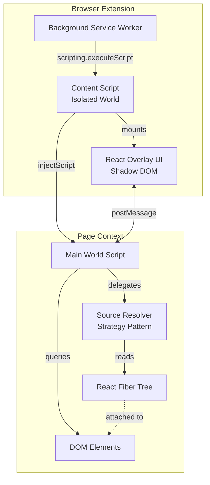
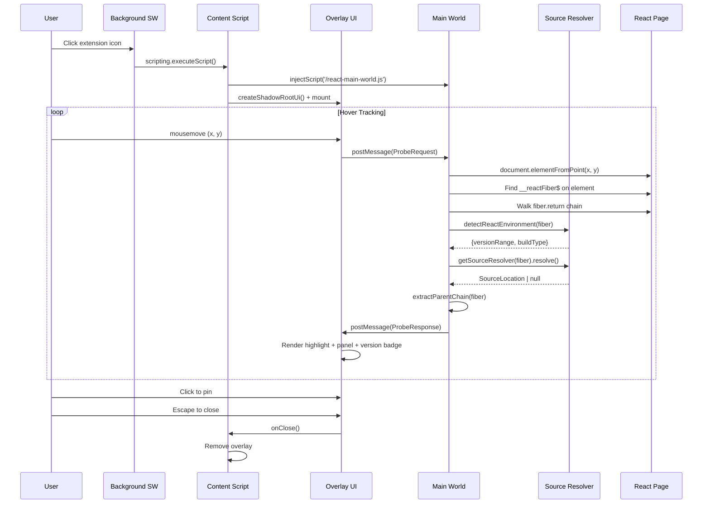
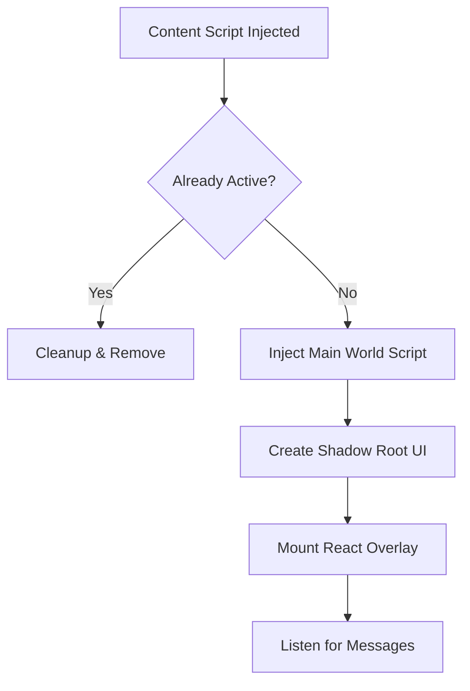
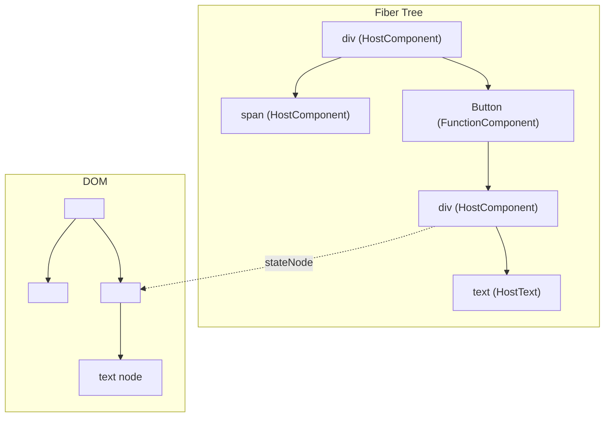
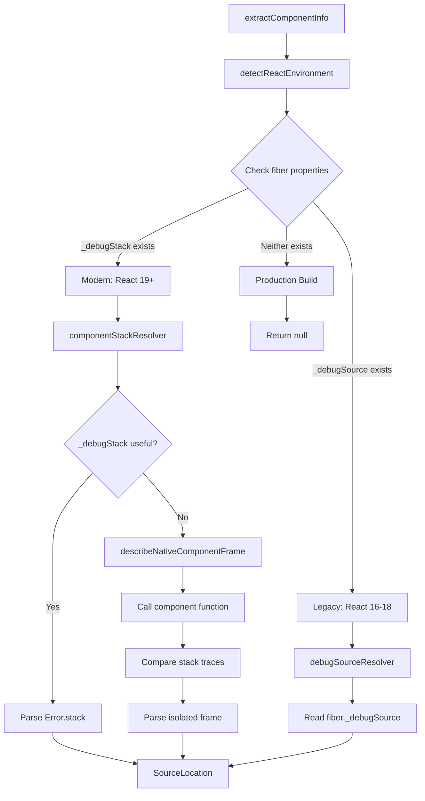
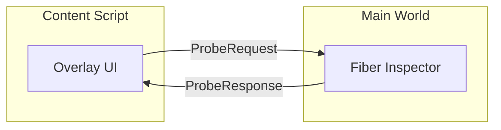
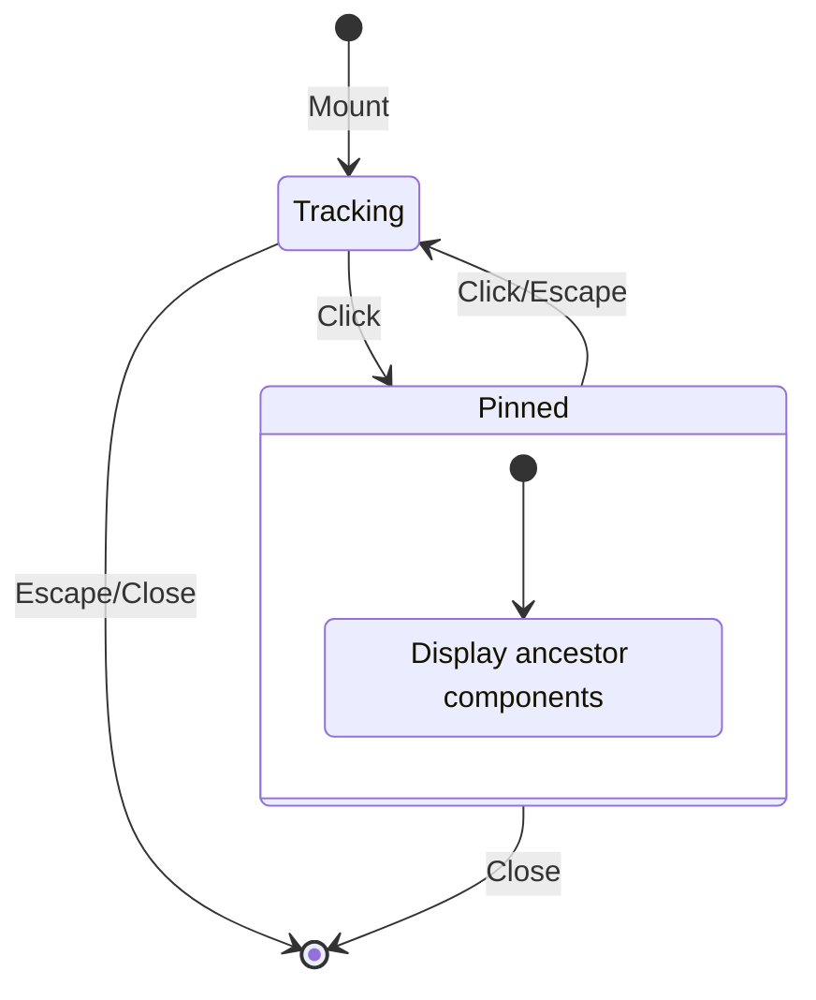

# WhoRenderedThis - Technical Architecture

## Overview

**WhoRenderedThis** is a Chromium browser extension that enables developers to visually inspect React applications by hovering over any UI element to discover which React component rendered it. The extension solves a fundamental challenge: bridging the gap between the visual DOM representation users see and the React component tree that generated it.

## The Problem

When debugging or exploring React applications, developers often ask: _"Which component rendered this element?"_ While React DevTools provides a component tree view, it requires context-switching between the page and DevTools panel. WhoRenderedThis brings this information directly into the page as an interactive overlay.

### Technical Challenges

1. **Isolated Context Boundaries**: Browser extensions run in an isolated world with no direct access to the page's JavaScript context where React's internal data structures live.

2. **React Fiber Internals**: React attaches internal `__reactFiber$` properties to DOM elements, but these are private APIs not accessible from extension content scripts.

3. **React Version Fragmentation**: React 19 removed the `_debugSource` property from fibers ([PR #28265](https://github.com/facebook/react/pull/28265)), breaking source location extraction for modern React apps. The extension must support multiple extraction strategies across React versions.

4. **CSS Collision**: Injected overlay UI must not be affected by the host page's styles, and vice versa.

5. **Performance**: Continuous hover tracking must not degrade page responsiveness.

---

## Architecture Overview

The extension uses a **three-layer architecture** to bridge the isolation boundary between extension scripts and the page's JavaScript context:



### Layer Responsibilities

| Layer           | File                    | World          | Purpose                                                       |
| --------------- | ----------------------- | -------------- | ------------------------------------------------------------- |
| Background      | `background.ts`         | Service Worker | Responds to extension icon clicks, injects content script     |
| Content Script  | `inspector.content.tsx` | Isolated       | Mounts overlay UI, bridges messages, manages lifecycle        |
| Main World      | `react-main-world.ts`   | Page Context   | Performs React Fiber introspection, returns component data    |
| Source Resolver | `source-resolver.ts`    | Page Context   | Version-aware source location extraction via strategy pattern |
| Overlay UI      | `Overlay.tsx`           | Shadow DOM     | Renders inspector panel, version badge, and highlight box     |
| Parent Chain UI | `ParentChainList.tsx`   | Shadow DOM     | Renders parent component hierarchy with source locations      |

---

## Message Flow Sequence



---

## Core Implementation Details

### 1. Background Service Worker (`entrypoints/background.ts`)

The background script is minimal by design. It listens for extension action clicks and injects the content script:

```typescript
export default defineBackground(() => {
  browser.action.onClicked.addListener(async (tab) => {
    if (!tab.id) return;
    await browser.scripting.executeScript({
      target: { tabId: tab.id },
      files: ['content-scripts/inspector.js'],
    });
  });
});
```

**Key Design Decisions:**

- Uses MV3 `scripting.executeScript` API (not manifest-declared content scripts)
- Runtime injection enables on-demand loading and toggle behavior
- Minimal permissions: only `activeTab` and `scripting`

---

### 2. Content Script (`entrypoints/inspector.content.tsx`)

The content script serves as the orchestration layer:



#### Toggle Mechanism

```typescript
const existing = document.querySelector(HOST_TAG) as InspectorHostElement | null;
if (existing) {
  if (typeof existing.__wrtCleanup === 'function') {
    existing.__wrtCleanup();
  } else {
    existing.remove();
  }
  return;
}
```

The toggle pattern stores a cleanup function on the host element, enabling clean teardown without persistent state.

#### Shadow DOM Isolation

WXT's `createShadowRootUi` provides complete CSS isolation:

```typescript
const ui = await createShadowRootUi<Root>(ctx, {
  name: HOST_TAG,           // Custom element: <who-rendered-this>
  position: 'overlay',      // Position fixed, no layout impact
  anchor: 'body',
  onMount(container, _shadowRoot, shadowHost) {
    const host = shadowHost as InspectorHostElement;
    host.__wrtCleanup = () => ui.remove();

    const root = createRoot(container);
    root.render(<Overlay onClose={() => ui.remove()} />);
    return root;
  },
  onRemove(root) {
    root?.unmount();
  },
});

ui.mount(); // Explicitly mount the UI
```

**Benefits:**

- Page styles cannot affect overlay appearance
- Overlay styles cannot leak into the page
- Clean mounting/unmounting lifecycle

---

### 3. Main World Script (`entrypoints/react-main-world.ts`)

This is the heart of React Fiber introspection. It runs in the page's JavaScript context, giving it access to React's internal data structures.

#### Fiber Key Discovery

React attaches internal data to DOM elements using keys with random suffixes:

```typescript
const FIBER_PREFIXES = ['__reactFiber$', '__reactInternalInstance$'];

function getFiber(el: Element): FiberNode | null {
  const keys = Object.getOwnPropertyNames(el);
  for (const key of keys) {
    for (const prefix of FIBER_PREFIXES) {
      if (!key.startsWith(prefix)) continue;
      const value = (el as Record<string, unknown>)[key];
      if (typeof value === 'object' && value !== null) {
        return value as FiberNode;
      }
    }
  }
  return null;
}
```

**Why multiple prefixes?** React's internal property names have changed across versions. Supporting both ensures compatibility with React 16+ through React 19.

#### Fiber Tree Navigation



The algorithm walks up the fiber tree to find user components:

```typescript
function findNearestComponentFiber(fiber: FiberNode): FiberNode | null {
  let current: FiberNode | null = fiber;
  while (current) {
    // User components have function/class types
    // Host components have string types like "div"
    if (current.type && typeof current.type !== 'string' && typeof current.type !== 'symbol') {
      return current;
    }
    current = current.return;
  }
  return null;
}
```

#### Component Information Extraction

The main world script delegates source resolution to the strategy-based resolver:

```typescript
function extractComponentInfo(fiber: FiberNode): ComponentInfo {
  const name = getComponentName(fiber.type);
  const env = detectReactEnvironment(fiber);
  const resolver = getSourceResolver(fiber);
  const source = resolver.resolve(fiber);
  const parentChain = extractParentChain(fiber);
  return {
    name,
    source,
    parentChain,
    reactVersionRange: env.versionRange,
    buildType: env.buildType,
  };
}
```

#### Component Name Extraction

React components can be named in various ways:

```typescript
function getComponentName(type: unknown): string {
  // Function component: type.name or type.displayName
  if (typeof type === 'function') {
    const displayName = getStringProp(type, 'displayName');
    return displayName ?? type.name ?? 'Anonymous';
  }

  if (isRecord(type)) {
    // Check displayName first
    const displayName = getStringProp(type, 'displayName');
    if (displayName) return displayName;

    // React.forwardRef: type.render
    const render = type.render;
    if (typeof render === 'function') return getComponentName(render);

    // React.memo: type.type
    const inner = type.type;
    if (inner) return getComponentName(inner);
  }

  return 'Anonymous';
}
```

**Handled cases:**

- Function components (`function MyComponent() {}`)
- Class components (`class MyComponent extends React.Component`)
- `displayName` static property
- `React.forwardRef` wrapped components
- `React.memo` wrapped components

---

### 4. Source Resolver (`lib/source-resolver.ts`)

The source resolver implements a **strategy pattern** to handle the breaking change in React 19, where `_debugSource` was removed from fibers. This module is extracted for testability—all pure functions can be directly unit-tested.



#### React Environment Detection

Uses the `in` operator to detect property key existence (not just value):

```typescript
export function detectReactEnvironment(fiber: FiberNode): ReactEnvironment {
  if (cachedEnv) return cachedEnv;

  if ('_debugSource' in fiber) {
    cachedEnv = { versionRange: 'legacy', buildType: 'dev' };
  } else if ('_debugStack' in fiber) {
    cachedEnv = { versionRange: 'modern', buildType: 'dev' };
  } else {
    cachedEnv = { versionRange: 'unknown', buildType: 'production' };
  }

  return cachedEnv;
}
```

| Fiber Property | React Version | Build Type  |
| -------------- | ------------- | ----------- |
| `_debugSource` | 16-18         | Development |
| `_debugStack`  | 19+           | Development |
| Neither        | Any           | Production  |

#### Stack Trace Parser

Parses both Chrome/V8 and Firefox/Safari stack trace formats:

```typescript
// Chrome/V8:  "    at ComponentName (http://localhost:3000/src/App.tsx:15:10)"
const CHROME_FRAME_RE = /^ *at (?:(.+) \((?:(.+):(\d+):(\d+))\)|(.+):(\d+):(\d+))$/;

// Firefox/Safari: "ComponentName@http://localhost:3000/src/App.tsx:15:10"
const FIREFOX_FRAME_RE = /^([^@]*)@(.+):(\d+):(\d+)$/;

export function parseFirstFrameFromStack(stack: string): SourceLocation | null {
  const lines = stack.split('\n');
  const isChrome = /^\s*at /m.test(stack);
  // ... parse and return {fileName, lineNumber, columnNumber}
}
```

#### DebugSourceResolver (React 16-18)

Simple property access for legacy React versions:

```typescript
export const debugSourceResolver: SourceResolver = {
  resolve(fiber: FiberNode): SourceLocation | null {
    const ds = fiber._debugSource;
    if (!ds || !isRecord(ds)) return null;
    if (typeof ds.fileName !== 'string') return null;

    return {
      fileName: ds.fileName,
      lineNumber: typeof ds.lineNumber === 'number' ? ds.lineNumber : 0,
      columnNumber: typeof ds.columnNumber === 'number' ? ds.columnNumber : 0,
    };
  },
};
```

#### ComponentStackResolver (React 19+)

Two-phase approach matching React DevTools' `describeNativeComponentFrame` technique:

**Phase 1 (Primary):** Parse `fiber._debugStack` — React 19 stores an Error object with a `.stack` property on fibers in dev mode.

**Phase 2 (Fallback):** If `_debugStack` is not useful, call the component function to generate a stack trace:

```typescript
function describeNativeComponentFrame(fn: Function): SourceLocation | null {
  // Generate a "control" stack (from this frame)
  const control = new Error();
  let sample: Error | null = null;

  // Detect class vs function component
  const proto = fn.prototype;
  if (proto && typeof proto.isReactComponent === 'object') {
    // Class component — use Reflect.construct
    try {
      Reflect.construct(fn, []);
    } catch (e) {
      sample = e instanceof Error ? e : null;
    }
  } else {
    // Function component — call directly
    try {
      fn({});
    } catch (e) {
      sample = e instanceof Error ? e : null;
    }
  }

  // Compare stacks to isolate the component frame
  // ... (diff control vs sample stack traces)
  return parseFirstFrameFromStack(componentFrame);
}
```

#### Parent Chain Extraction

Walks the fiber `.return` chain to collect ancestor component names and source locations:

```typescript
export function extractParentChain(
  fiber: FiberNode,
  resolver: SourceResolver,
  maxDepth = 5,
): ParentInfo[] {
  const chain: ParentInfo[] = [];
  let current = fiber.return ?? null;

  while (current && chain.length < maxDepth) {
    if (current.type && typeof current.type !== 'string' && typeof current.type !== 'symbol') {
      chain.push({
        name: getComponentName(current.type),
        source: resolver.resolve(current),
      });
    }
    current = current.return ?? null;
  }

  return chain;
}
```

---

### 5. Message Bridge (`lib/bridge.ts`)

Type-safe communication between content script and main world with enhanced component metadata:



#### Type Definitions

```typescript
// React environment type aliases
export type ReactBuildType = 'dev' | 'production' | 'unknown';
export type ReactVersionRange = 'legacy' | 'modern' | 'unknown';
// legacy = React 16-18 (_debugSource), modern = React 19+ (_debugStack)

// Parent component info (for parent chain with sources)
interface ParentInfo {
  name: string;
  source: { fileName: string; lineNumber: number; columnNumber: number } | null;
}

// Request: "What component is at coordinates (x, y)?"
interface ProbeRequest {
  channel: 'who-rendered-this';
  type: 'probe-request';
  x: number;
  y: number;
}

// Enhanced component information
interface ComponentInfo {
  name: string;
  source: { fileName: string; lineNumber: number; columnNumber: number } | null;
  parentChain: ParentInfo[]; // Parent components with names and sources (nearest-first, max 5)
  reactVersionRange: ReactVersionRange;
  buildType: ReactBuildType;
}

// Response: Component info + bounding rect
interface ProbeResponse {
  channel: 'who-rendered-this';
  type: 'probe-response';
  component: ComponentInfo | null;
  rect: { top: number; left: number; width: number; height: number } | null;
}
```

#### Backward-Compatible Type Guards

Runtime validation accepts both old and new message formats:

```typescript
function isComponentInfo(value: unknown): value is ComponentInfo {
  if (!isRecord(value)) return false;
  if (typeof value.name !== 'string') return false;

  // Validate source...

  // Validate new fields when present (backward-compatible)
  if ('parentChain' in value && !isStringArray(value.parentChain)) return false;
  if ('reactVersionRange' in value) {
    const v = value.reactVersionRange;
    if (v !== 'legacy' && v !== 'modern' && v !== 'unknown') return false;
  }
  if ('buildType' in value) {
    const b = value.buildType;
    if (b !== 'dev' && b !== 'production' && b !== 'unknown') return false;
  }

  return true;
}
```

---

### 6. Overlay UI (`components/Overlay.tsx`)

The React overlay provides the visual interface with version awareness:



#### Version Badge

Displays the detected React version range and build type:

```typescript
const versionLabel = (() => {
  const base =
    versionRange === 'legacy' ? 'React 16-18' : versionRange === 'modern' ? 'React 19+' : 'React';
  return buildType === 'production' ? `${base} (prod)` : base;
})();

// Rendered as: <span className="wrt-badge">{versionLabel}</span>
```

#### Parent Chain Display

When pinned, shows the component's ancestor hierarchy with source locations via the `ParentChainList` component:

```typescript
{pinned && parentChain.length > 0 && <ParentChainList parents={parentChain} />}
// Renders as a scrollable list showing: "App (App.tsx:5)", "Layout (Layout.tsx:12)", etc.
```

The `ParentChainList` component formats each parent with its source location:

```typescript
function formatSource(source: ParentInfo['source']): string | null {
  if (!source) return null;
  const fileName = source.fileName.split('/').pop() ?? source.fileName;
  return `${fileName}:${source.lineNumber}`;
}
```

#### Enhanced Copy Functionality

Includes source location in copied text:

```typescript
const text = component.source
  ? `${component.name} (${component.source.fileName}:${component.source.lineNumber})`
  : component.name;
// Example: "Button (src/components/Button.tsx:42)"
```

#### Performance Optimization

Hover tracking uses `requestAnimationFrame` throttling:

```typescript
function onMove(e: MouseEvent) {
  lastMouseRef.current = { x: e.clientX, y: e.clientY };
  if (!rafRef.current) {
    rafRef.current = requestAnimationFrame(() => {
      rafRef.current = 0;
      const { x, y } = lastMouseRef.current;
      const key = `${x},${y}`;
      if (key === lastElRef.current) return; // Skip if unchanged
      lastElRef.current = key;
      sendProbe(x, y);
    });
  }
}
```

**Optimizations:**

- `requestAnimationFrame` batches updates to display refresh rate (~60fps)
- Position deduplication prevents redundant probes
- Panel position calculated to stay within viewport bounds
- Dynamic panel height based on parent chain visibility

#### Overlay Visibility During Probing

The main world script temporarily disables the overlay when probing to ensure `elementFromPoint` hits the actual page element:

```typescript
function withOverlayDisabled<T>(fn: () => T): T {
  const hosts = document.querySelectorAll<HTMLElement>(OVERLAY_HOST_TAG);
  hosts.forEach((host) => host.setAttribute(PROBING_ATTR, '1'));
  try {
    return fn();
  } finally {
    hosts.forEach((host) => host.removeAttribute(PROBING_ATTR));
  }
}
```

CSS makes the panel non-interactive during probing:

```css
:host([data-wrt-probing='1']) .wrt-panel,
:host([data-wrt-probing='1']) .wrt-panel * {
  pointer-events: none !important;
}
```

---

## Caching Strategy

The extension employs a multi-layer caching strategy to optimize performance:

| Cache                      | Type                              | Key              | Lifetime   |
| -------------------------- | --------------------------------- | ---------------- | ---------- |
| React environment          | Module variable                   | Singleton        | Page load  |
| Active source resolver     | Module variable                   | Singleton        | Page load  |
| Component source locations | `WeakMap<object, SourceLocation>` | `fiber.type` ref | GC-managed |

**Benefits:**

- Same component hovered 100x = only 1 stack generation (React 19+)
- React version detection happens once per page
- WeakMap ensures cache entries are garbage-collected when components unmount

---

## Manifest Configuration

```typescript
// wxt.config.ts
export default defineConfig({
  modules: ['@wxt-dev/module-react'],
  manifest: {
    name: 'WhoRenderedThis',
    description: 'Hover over any element on a React app to see which component rendered it.',
    icons: {
      16: 'icon/16.png',
      32: 'icon/32.png',
      48: 'icon/48.png',
      96: 'icon/96.png',
      128: 'icon/128.png',
    },
    action: {}, // No popup - click toggles inspector
    permissions: ['activeTab', 'scripting'],
    web_accessible_resources: [
      {
        resources: ['react-main-world.js'],
        matches: ['<all_urls>'],
      },
    ],
  },
});
```

**Permission Rationale:**

- `activeTab`: Grants temporary access to the current tab when clicked (no broad host permissions needed)
- `scripting`: Required for `scripting.executeScript` API
- `web_accessible_resources`: Exposes the main world script so it can be injected into pages

---

## Project Structure

```
WhoRenderedThis/
├── entrypoints/
│   ├── background.ts           # MV3 service worker
│   ├── inspector.content.tsx   # Runtime content script
│   └── react-main-world.ts     # Main world fiber inspector
├── components/
│   ├── Overlay.tsx             # React overlay UI with version badge
│   ├── Overlay.css             # Overlay styles (Shadow DOM)
│   ├── ParentChainList.tsx     # Parent chain with source locations
│   ├── ParentChainList.css     # Parent chain styles
│   └── inspector-host.css      # Host element reset
├── lib/
│   ├── bridge.ts               # Message types, guards, and type aliases
│   └── source-resolver.ts      # Version-aware source extraction (strategy pattern)
├── tests/
│   ├── background.test.ts      # Background service worker tests
│   ├── bridge.test.ts          # Message bridge tests
│   ├── inspector.content.test.ts
│   ├── Overlay.test.tsx        # Overlay component tests
│   ├── ParentChainList.test.tsx # Parent chain list component tests
│   ├── react-main-world.test.ts
│   └── source-resolver.test.ts # Stack parser, version detection, resolver tests
├── public/
│   └── icon/                   # Extension icons
├── docs/
│   └── architecture.md         # This document
├── wxt.config.ts               # WXT + manifest config
├── vitest.config.ts            # Vitest test configuration
└── package.json
```

---

## Known Limitations

### 1. Production Builds

Minified production React builds have:

- Shortened component names (`t`, `e`, `n` instead of `UserProfile`)
- Stripped `_debugSource` and `_debugStack` information
- Tree-shaken `displayName` properties

**Mitigation:** The extension detects production builds and displays a "(prod)" badge. Component names are shown as available, even if minified. Source location will be `null`.

### 2. React 19+ Side Effects

The `describeNativeComponentFrame` fallback technique calls component functions to generate stack traces. This may trigger side effects.

**Mitigation:**

- Results are cached in a `WeakMap` keyed on `fiber.type` — each component type is called at most once
- Wrapped in try/catch to handle errors gracefully
- Same approach used by React DevTools

### 3. iframes and Shadow DOM

The current implementation only inspects the top-level document.

**Future enhancement:** Traverse into iframes by injecting the main world script into each frame.

### 4. Non-React Applications

On pages without React, the extension gracefully shows "No React component found."

### 5. React Internals Are Private

The `__reactFiber$`, `_debugSource`, and `_debugStack` properties are implementation details, not public APIs. While they have remained relatively stable, future React versions could change them.

### 6. Multiple React Versions on Same Page

If a page contains multiple React versions (e.g., micro-frontends), the first fiber detected determines the environment. This is an acceptable edge case.

---

## Security Considerations

1. **No persistent permissions**: Uses `activeTab` which only grants access when the user explicitly clicks the extension icon.

2. **No data collection**: All processing happens locally; no external network requests.

3. **Isolated UI**: Shadow DOM prevents style/script interference with host pages.

4. **Message validation**: Type guards ensure only expected message shapes are processed.

5. **Limited component invocation**: The React 19+ fallback only calls components in dev builds, cached per-type, with error handling.

---

## Technology Stack

| Component      | Technology                                                |
| -------------- | --------------------------------------------------------- |
| Framework      | [WXT](https://wxt.dev) (Vite-powered extension framework) |
| UI Library     | React 19                                                  |
| Language       | TypeScript 5.x                                            |
| CSS Isolation  | Shadow DOM                                                |
| Build          | Vite + WXT                                                |
| Testing        | Vitest + Testing Library                                  |
| Linting        | ESLint + Prettier                                         |
| Design Pattern | Strategy Pattern (source resolution)                      |

---

## References

- [WXT Documentation](https://wxt.dev)
- [Chrome Extension Manifest V3](https://developer.chrome.com/docs/extensions/mv3/)
- [React Fiber Architecture](https://github.com/acdlite/react-fiber-architecture)
- [Shadow DOM](https://developer.mozilla.org/en-US/docs/Web/API/Web_components/Using_shadow_DOM)
- [React 19 \_debugSource Removal](https://github.com/facebook/react/issues/29092) — Issue #29092
- [React DevTools ComponentStackFrame](https://github.com/facebook/react/blob/main/packages/react-devtools-shared/src/backend/shared/DevToolsComponentStackFrame.js) — Reference implementation
