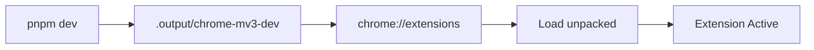
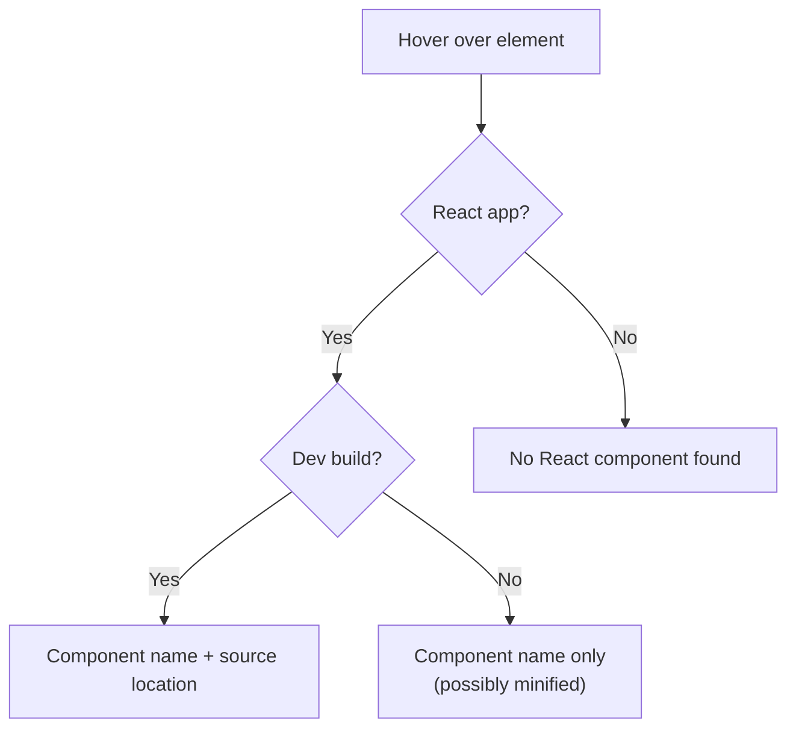
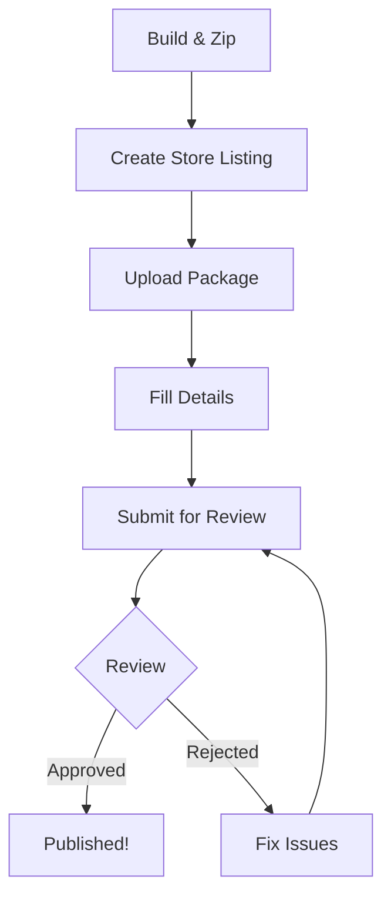
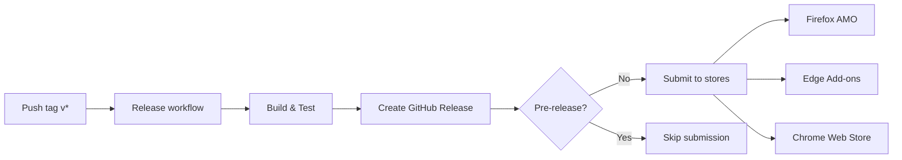

# Testing and Publishing Guide

This guide covers how to test WhoRenderedThis locally during development and how to publish it to the Chrome Web Store, Microsoft Edge Add-ons, and Firefox Add-ons.

---

## Table of Contents

1. [Local Development Testing](#local-development-testing)
2. [Unit Testing](#unit-testing)
3. [Manual Testing Checklist](#manual-testing-checklist)
4. [Testing on React Applications](#testing-on-react-applications)
5. [Building for Production](#building-for-production)
6. [Publishing to Chrome Web Store](#publishing-to-chrome-web-store)
7. [Publishing to Microsoft Edge Add-ons](#publishing-to-microsoft-edge-add-ons)
8. [Publishing to Firefox Add-ons](#publishing-to-firefox-add-ons)
9. [Version Updates](#version-updates)
10. [Automated Publishing](#automated-publishing) - **Recommended**

---

## Local Development Testing

### Prerequisites

- Node.js 20+
- pnpm (recommended) or npm
- Chrome or Edge browser

### Setup

```bash
# Install dependencies
pnpm install

# Start development mode with hot reload
pnpm dev
```

### Loading the Extension in Chrome



1. Run `pnpm dev` - this starts the WXT dev server and outputs to `.output/chrome-mv3-dev/`

2. Open Chrome and navigate to `chrome://extensions`

3. Enable **Developer mode** (toggle in top-right corner)

4. Click **Load unpacked**

5. Select the `.output/chrome-mv3-dev` folder

6. The extension icon should appear in your toolbar

### Loading the Extension in Edge

1. Run `pnpm dev` (same dev output works for Edge)

2. Navigate to `edge://extensions`

3. Enable **Developer mode** (toggle in left sidebar)

4. Click **Load unpacked**

5. Select the `.output/chrome-mv3-dev` folder

### Hot Reload

WXT provides automatic hot reload for:

- Content script changes
- Background script changes
- UI component changes

When you save a file, the extension automatically reloads. For some changes (especially manifest changes), you may need to manually click the reload button on the extensions page.

---

## Unit Testing

This project uses Vitest with WXT's testing plugin for unit tests. The WXT plugin wires extension globals and provides an in-memory fake browser API for deterministic tests.

### Run Unit Tests

```bash
# Start Vitest in watch mode
pnpm test

# Run once (CI/local verification)
pnpm test:run

# Run with coverage
pnpm test:coverage
```

### Test Scope

Unit tests currently cover:

- Message type guards in `lib/bridge.ts`
- Background action-click script injection flow
- Content script toggle and mount orchestration
- Main-world probe request/response behavior
- Overlay rendering and interactions (pin/unpin, close, copy feedback)

---

## Manual Testing Checklist

### Basic Functionality

| Test Case                    | Expected Result                    | Notes                        |
| ---------------------------- | ---------------------------------- | ---------------------------- |
| Click extension icon         | Inspector overlay appears          | Should see floating panel    |
| Click icon again             | Overlay disappears                 | Toggle behavior              |
| Hover over React element     | Component name shows in panel      | Highlight box around element |
| Hover over non-React element | "No React component found" message | Graceful fallback            |
| Press Escape                 | Overlay closes                     | When not pinned              |

### Pin/Unpin Behavior

| Test Case                    | Expected Result                                  |
| ---------------------------- | ------------------------------------------------ |
| Click on highlighted element | Selection becomes pinned (indicator dot appears) |
| Click anywhere while pinned  | Unpins selection, resumes tracking               |
| Press Escape while pinned    | Unpins without closing overlay                   |

### Copy Functionality

| Test Case                | Expected Result                       |
| ------------------------ | ------------------------------------- |
| Click "Copy name" button | Component name copied to clipboard    |
| Button shows "Copied!"   | Feedback confirmation for 1.5 seconds |

### Edge Cases

| Test Case                         | Expected Result                                   |
| --------------------------------- | ------------------------------------------------- |
| Non-React page (e.g., google.com) | Shows "No React component found"                  |
| Page with Shadow DOM              | Inspects top-level components only                |
| Extension on extension pages      | Should not crash (may not work on chrome:// URLs) |
| Multiple rapid hovers             | No performance degradation                        |

### Development Build Features

| Test Case              | Expected Result                             |
| ---------------------- | ------------------------------------------- |
| React app in dev mode  | Shows component name + source file location |
| Source location format | `src/components/Button.tsx:42`              |

---

## Testing on React Applications

### Recommended Test Sites

**Development builds (best results with source locations):**

- Local Vite + React app (`npm create vite@latest -- --template react-ts`)
- Local Next.js app (`npx create-next-app@latest`)
- Local Create React App (`npx create-react-app test-app`)

**Production sites (minified names):**

- [React.dev](https://react.dev) - React's official documentation
- [Vercel Dashboard](https://vercel.com) - Next.js production app
- [Linear](https://linear.app) - React production app

### Creating a Local Test App

```bash
# Create a simple Vite + React app
npm create vite@latest test-react-app -- --template react-ts
cd test-react-app
npm install
npm run dev
```

Open `http://localhost:5173`, then:

1. Click the WhoRenderedThis extension icon
2. Hover over the Vite logo - should show `App` component
3. Hover over the counter button - should show component name + source location

### What to Look For



---

## Building for Production

### Chrome Production Build

```bash
# Build production bundle
pnpm build

# Output: .output/chrome-mv3/

# Create distributable zip
pnpm zip

# Output: .output/who-rendered-this-x.x.x-chrome.zip
```

### Firefox Production Build

```bash
pnpm build:firefox
# Output: .output/firefox-mv3/

pnpm zip:firefox
# Output: .output/who-rendered-this-x.x.x-firefox.zip
```

### Build Output Structure

```
.output/
├── chrome-mv3/           # Production build for Chrome
│   ├── manifest.json
│   ├── background.js
│   ├── content-scripts/
│   │   └── inspector.js
│   ├── react-main-world.js
│   └── icon/
└── who-rendered-this-0.1.0-chrome.zip  # Distributable
```

### Pre-submission Checks

Before submitting to stores:

1. **Type check**: `pnpm compile`
2. **Lint**: `pnpm lint`
3. **Test the production build**:
   - Load the `.output/chrome-mv3/` folder as unpacked extension
   - Verify all functionality works without dev server

---

## Publishing to Chrome Web Store

### Prerequisites

1. **Google Developer Account**: Register at [Chrome Web Store Developer Dashboard](https://chrome.google.com/webstore/devconsole)
2. **One-time registration fee**: $5 USD
3. **Extension zip file**: Generated by `pnpm zip`
4. **Store assets**: Use `docs/store-assets/`

### Step-by-Step Process



#### 1. Prepare Store Assets

You'll need:

| Asset                  | Requirements                                      |
| ---------------------- | ------------------------------------------------- |
| Icon                   | 128x128 PNG (already in `public/icon/`)           |
| Screenshots            | At least 1 (recommended 2-5), 1280x800 or 640x400 |
| Small promotional tile | 440x280 PNG (commonly required)                   |
| Marquee                | 1400x560 PNG (optional)                           |
| Video                  | YouTube URL (commonly required)                   |

See `docs/store-assets/` for existing screenshots and promo images, and use `docs/privacy-policy.md` as your privacy policy URL.

**Creating screenshots:**

1. Load the extension on a React app
2. Activate the inspector
3. Take screenshots showing the overlay in action
4. Recommended: Show different states (hovering, pinned, source info)

#### 2. Create Store Listing

1. Go to [Chrome Web Store Developer Dashboard](https://chrome.google.com/webstore/devconsole)

2. Click **Add new item**

3. Upload the zip file: `.output/who-rendered-this-x.x.x-chrome.zip`

4. Fill in the listing details:

   **Store listing tab:**
   - **Name**: WhoRenderedThis
   - **Summary** (132 chars max): Hover over any UI element on React apps to see which component rendered it. Instant visual debugging.
   - **Description**: Full description of features and usage
   - **Category**: Developer Tools
   - **Language**: English

   **Privacy tab:**
   - **Single purpose**: Inspect React component rendering on the current page when the user activates the extension
   - **Permissions justification**:
     - `activeTab`: To inject inspector into the current page when clicked
     - `scripting`: To dynamically inject content and main-world scripts
   - **Data usage**: Does not collect any user data
   - **Privacy policy**: Provide a URL (recommended): `docs/privacy-policy.md`

   **Graphics tab:**
   - Upload screenshots
   - Upload promotional images (as required)
   - Add YouTube demo video URL (as required)

#### 3. Submit for Review

1. Click **Submit for review**

2. Review typically takes 1-3 business days

3. You'll receive an email when approved or if changes are needed

**Staged publish recommendation:** choose "publish later" (or equivalent) so you can control the exact publish moment. Note that approved submissions can expire if you don't publish within the allowed window (commonly ~30 days), so publish soon after approval.

### Common Rejection Reasons

| Reason                 | Solution                                           |
| ---------------------- | -------------------------------------------------- |
| Missing privacy policy | Add statement that no data is collected            |
| Unclear permissions    | Provide detailed justification for each permission |
| Broken functionality   | Test production build thoroughly before submission |
| Misleading description | Ensure description matches actual functionality    |

---

## Publishing to Microsoft Edge Add-ons

### Prerequisites

1. **Microsoft Partner Center Account**: Register at [Partner Center](https://partner.microsoft.com/dashboard/microsoftedge/public/login)
2. **No registration fee**
3. **Same zip file** as Chrome (MV3 compatible)

### Key Differences from Chrome

| Aspect           | Chrome                     | Edge                     |
| ---------------- | -------------------------- | ------------------------ |
| Registration fee | $5                         | Free                     |
| Review time      | 1-3 days                   | 1-7 days                 |
| Dashboard        | Chrome Developer Dashboard | Microsoft Partner Center |
| Manifest version | MV3                        | MV3 (same build works)   |

### Step-by-Step Process

#### 1. Prepare Submission

Use the same zip file from `pnpm zip` - Edge accepts Chrome-compatible MV3 extensions.

#### 2. Create Listing in Partner Center

1. Go to [Microsoft Partner Center](https://partner.microsoft.com/dashboard/microsoftedge/overview)

2. Navigate to **Edge Add-ons** section

3. Click **Create new extension**

4. Upload your zip file

5. Fill in details:

   **Properties:**
   - **Extension name**: WhoRenderedThis
   - **Short description**: Hover over React UI elements to see which component rendered them
   - **Category**: Developer Tools

   **Listing details:**
   - **Description**: Full feature description
   - **Screenshots**: Same as Chrome (at least 1 required)
   - **Support URL**: GitHub issues URL (optional)

   **Privacy:**
   - **Privacy policy URL**: Optional if no data collection
   - Confirm no data collection

#### 3. Submit and Wait

1. Click **Publish**

2. Review typically takes 3-7 business days

3. Monitor Partner Center for status updates

---

## Publishing to Firefox Add-ons

### Prerequisites

1. Firefox Add-ons (AMO) developer account
2. Firefox zip file: generated by `pnpm zip:firefox`

### Step-by-Step Process

1. Build the Firefox package:

   ```bash
   pnpm build:firefox
   pnpm zip:firefox
   ```

2. Go to the AMO Developer Hub:
   - https://addons.mozilla.org/developers/

3. Create a new add-on (first time) or select your existing add-on (updates).

4. Upload the package:
   - `.output/who-rendered-this-x.x.x-firefox.zip`

5. Fill in the listing details and submit for review.

> Tip: For automated publishing to AMO, use the GitHub Actions "Release" workflow and configure secrets in `docs/PUBLISHING_CREDENTIALS.md`.

---

## Version Updates

### Updating Version Number

1. Update version in `package.json`:

   ```json
   {
     "version": "0.2.0"
   }
   ```

2. Rebuild: `pnpm zip`

3. The new zip will be named: `who-rendered-this-0.2.0-chrome.zip`

### Semantic Versioning Guidelines

| Version Bump  | When to Use                            |
| ------------- | -------------------------------------- |
| Major (1.0.0) | Breaking changes, major UI overhaul    |
| Minor (0.2.0) | New features, significant improvements |
| Patch (0.1.1) | Bug fixes, small improvements          |

### Submitting Updates

**Chrome:**

1. Go to Developer Dashboard
2. Click on your extension
3. If CI automation uploaded a draft already, review it; otherwise upload a new zip in the **Package** tab
4. Submit for review
5. After approval, publish when ready (staged/manual publish recommended)

**Edge:**

1. Go to Partner Center
2. Select your extension
3. Click **Update**
4. Upload new zip
5. Submit for review

---

## Automated Publishing

This project uses [WXT Submit](https://wxt.dev/guide/essentials/publishing) for automated store publishing via GitHub Actions.

### How It Works



When you push a version tag (e.g., `v0.2.0`), the release workflow:

1. Builds Chrome and Firefox versions
2. Runs type-check, lint, and tests
3. Creates a GitHub release with ZIP files
4. Submits to Firefox and Edge stores (skipped for pre-releases)
5. Uploads a draft update to Chrome Web Store **if** `CHROME_*` secrets are configured

> Chrome is configured to upload a **draft only** (no auto-submit for review) so you can use a staged/manual publish flow in the CWS dashboard.

### Setting Up Credentials

See **[PUBLISHING_CREDENTIALS.md](./PUBLISHING_CREDENTIALS.md)** for detailed instructions on:

- Getting Firefox AMO API credentials
- Getting Edge Partner Center API credentials
- Configuring GitHub secrets
- Handling Edge API key rotation (72-day expiry)

### Required GitHub Secrets

| Secret                 | Store   | Required |
| ---------------------- | ------- | -------- |
| `FIREFOX_EXTENSION_ID` | Firefox | Yes      |
| `FIREFOX_JWT_ISSUER`   | Firefox | Yes      |
| `FIREFOX_JWT_SECRET`   | Firefox | Yes      |
| `EDGE_PRODUCT_ID`      | Edge    | Yes      |
| `EDGE_CLIENT_ID`       | Edge    | Yes      |
| `EDGE_API_KEY`         | Edge    | Yes      |
| `CHROME_EXTENSION_ID`  | Chrome  | Optional |
| `CHROME_CLIENT_ID`     | Chrome  | Optional |
| `CHROME_CLIENT_SECRET` | Chrome  | Optional |
| `CHROME_REFRESH_TOKEN` | Chrome  | Optional |

### Testing Credentials (Dry Run)

Before releasing, verify your credentials work:

1. Go to **Actions** → **Submit Dry Run**
2. Click **Run workflow**
3. Select stores to test (all, firefox, edge, or chrome)
4. Check logs for authentication success

### Releasing a New Version

```bash
# 1. Update version in package.json
# 2. Commit changes
git add -A
git commit -m "chore: bump version to 0.2.0"

# 3. Create and push tag
git tag -a v0.2.0 -m "v0.2.0 - Feature description"
git push origin main
git push origin v0.2.0
```

### Pre-releases

Tags containing `-alpha`, `-beta`, or `-rc` are treated as pre-releases:

- GitHub release is marked as pre-release
- Store submission is **skipped**

```bash
git tag -a v0.3.0-beta.1 -m "v0.3.0-beta.1"
git push origin v0.3.0-beta.1
```

### Monitoring Releases

After pushing a tag:

1. **GitHub Actions**: Watch the Release workflow complete
2. **Firefox**: Check [Developer Hub](https://addons.mozilla.org/developers/) for pending review
3. **Edge**: Check [Partner Center](https://partner.microsoft.com/dashboard/microsoftedge/) for pending review
4. **Chrome**: Check [Chrome Web Store Developer Dashboard](https://chrome.google.com/webstore/devconsole) for draft/upload status

Review times:

- Firefox: Usually 1-3 days
- Edge: Usually 3-7 days
- Chrome: Usually 1-3 days (varies)

---

## Troubleshooting

### Extension Not Loading

| Symptom                              | Solution                                      |
| ------------------------------------ | --------------------------------------------- |
| "Manifest file is missing"           | Ensure you selected the correct output folder |
| "Service worker registration failed" | Check for syntax errors in background.ts      |
| No icon in toolbar                   | Check manifest icon paths                     |

### Extension Not Working on Page

| Symptom                                 | Solution                                                      |
| --------------------------------------- | ------------------------------------------------------------- |
| Click does nothing                      | Check browser console for errors                              |
| "No React component found" on React app | Verify page has React (check for `__reactFiber$` in DevTools) |
| Overlay appears but no highlight        | Check if page uses Shadow DOM heavily                         |

### Store Submission Issues

| Issue                | Solution                                           |
| -------------------- | -------------------------------------------------- |
| Zip too large        | Check for accidentally included node_modules       |
| Review rejection     | Read feedback carefully, make required changes     |
| Screenshots rejected | Ensure correct dimensions, no sensitive data shown |

---

## Resources

- [Chrome Web Store Developer Documentation](https://developer.chrome.com/docs/webstore/)
- [Microsoft Edge Add-ons Documentation](https://docs.microsoft.com/en-us/microsoft-edge/extensions-chromium/publish/publish-extension)
- [WXT Deployment Guide](https://wxt.dev/guide/publishing.html)
- [Extension Manifest V3 Migration](https://developer.chrome.com/docs/extensions/mv3/intro/)
